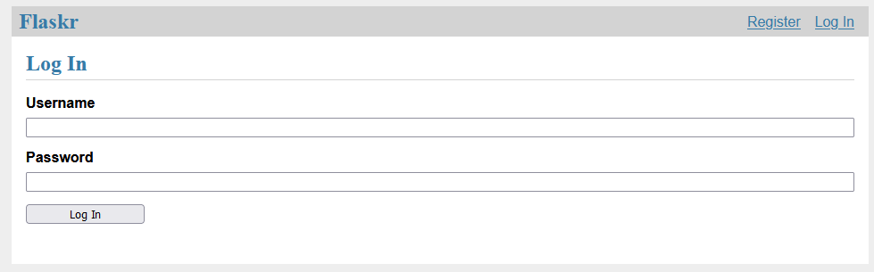

## Readme Information
> [!NOTE]
> **I started from the official Flask Documentation https://flask.palletsprojects.com/en/3.0.x/**
> 
Until further notice this is exactly, what you can find in here. 
The idea is to further from there later on.

## How to install it?
1. Go into a Command line folder, where you clone this git.
2. Clone this git via:
```sh
git clone git@github.com:ManuelEitel/flask-my-practice-blog.git
```
3. Initialize the Database in the root folder of the cloned git.
```sh
flask --app flaskr init-db
```
4. Run this app in the root folder of the cloned git.
```sh
flask --app flaskr run
```
5. Open a browser of your choice on your computer and open the website.
- http://127.0.0.1:5000/auth/login

You shoud see the main page:

